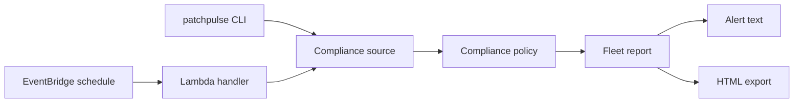

# PatchPulse

Reports which EC2 instances are behind on security patches and produces an alert you can send
to the people who own them.

[](https://github.com/mehedi-hasan-2426/patchpulse/actions/workflows/ci.yml)
[](LICENSE)


## Overview

Patch dashboards show what is missing, but they rarely tell you which machines have stopped
reporting at all. PatchPulse checks every instance against a simple policy, flags instances
whose last patch scan is too old to trust, and lists the problems in one short message. It
runs from the command line or on a schedule in AWS Lambda.

## Example

```text
$ patchpulse --as-of 2026-10-01T12:00:00+00:00
PatchPulse: 3 of 5 instances need attention (2026-10-01T12:00:00+00:00)

- reporting-01 (i-0a1b2c3d4e5f6071b): stale, last patch scan 19 days ago
- web-02 (i-0a1b2c3d4e5f60719): non_compliant, 2 critical patches missing; 1 security patches missing
- batch-01 (i-0a1b2c3d4e5f6071a): non_compliant, 4 security patches missing
```

This is the output for the synthetic fleet in `fixtures/fleet.json`.

## How it works



A compliance source returns one record per instance. The policy turns each record into one
of three states:

| State | When |
|---|---|
| `stale` | The last patch scan is older than the allowed age. Stale instances are listed first, because missing data can hide missing patches. |
| `non_compliant` | More critical or security patches are missing than the policy allows. |
| `compliant` | The scan is recent and the missing patches are within the limits. |

The report counts each state. If anything is stale or non-compliant, it also produces the
alert text shown above. The Lambda handler returns the report and alert as JSON. The CLI
prints the alert and can also write the report as an HTML file.

## Quick start

You need Python 3.12 or newer.

```sh
git clone https://github.com/mehedi-hasan-2426/patchpulse.git
cd patchpulse
python -m venv .venv
```

Activate the environment with `source .venv/bin/activate` on Linux and macOS, or
`.venv\Scripts\Activate.ps1` in PowerShell on Windows. Then install and run:

```sh
pip install -e .
patchpulse --as-of 2026-10-01T12:00:00+00:00
```

`--as-of` fixes the evaluation time, so the output matches the example above. Without it,
PatchPulse uses the current time and the synthetic instances become stale as their scan dates
age.

Add `--html report.html` to also write the report as a standalone HTML file, for example to
attach to a ticket.

## Configuration

| Variable | Default | Allowed |
|---|---|---|
| `PATCHPULSE_FIXTURE_PATH` | `fixtures/fleet.json` | Path to a fleet JSON file |
| `PATCHPULSE_MAX_CRITICAL_MISSING` | `0` | 0 to 100 |
| `PATCHPULSE_MAX_SECURITY_MISSING` | `0` | 0 to 100 |
| `PATCHPULSE_MAX_SCAN_AGE_DAYS` | `7` | 1 to 90 |

Invalid values stop the run with a clear message instead of falling back silently.

## Design

```text
src/patchpulse/
  models.py    instance data, compliance states, findings
  policy.py    thresholds and the rules that turn data into findings
  sources.py   where data comes from, plus strict validation of fleet input
  report.py    report building and alert text
  page.py      static HTML page for the report
  settings.py  environment configuration with bounds
  handler.py   Lambda entry point
  __main__.py  command line entry point
```

Data sources share one small interface, `ComplianceSource`. The demo source reads a JSON
file. The SSM source planned for milestone 5 will implement the same interface, so the policy,
report and alert code will not change when real data is added.

Fleet data is treated as untrusted input. Instance IDs, names, counts and timestamps are
validated, timestamps must include a time zone, duplicates are rejected, and the instance count
is capped.

## Development

```powershell
.\.venv\Scripts\ruff check .
.\.venv\Scripts\ruff format --check .
.\.venv\Scripts\mypy
.\.venv\Scripts\pytest
```

CI runs the same checks plus a gitleaks secret scan. Tests fail below 95% coverage. Actions
are pinned to commit SHAs and Dependabot keeps them and the dev tools up to date.

Build the Lambda deployment package with:

```powershell
.\.venv\Scripts\python -m tools.package_lambda
```

The archive is written to `dist/lambda.zip`. Entries are sorted and timestamps are fixed, so
unchanged source always produces the same file hash.

## Infrastructure

```text
infra/modules/lambda/  reusable module: function, role, log group, schedule
infra/envs/dev/        dev environment using the module
```

The [Lambda module](infra/modules/lambda/README.md) can be reused on its own. CI checks
formatting and runs `terraform validate` on every pull request, without AWS credentials.
Nothing has been applied to a real AWS account yet.

To deploy the dev environment into your own account:

1. Create an S3 bucket for Terraform state, then copy `infra/envs/dev/backend.hcl.example`
   to `backend.hcl` and set the bucket name. `backend.hcl` is ignored by Git.
2. Build the package: `python -m tools.package_lambda`.
3. From `infra/envs/dev`, run `terraform init -backend-config=backend.hcl`, then
   `terraform plan` and, after reviewing it, `terraform apply`.
4. Invoke it once with `aws lambda invoke --function-name patchpulse-dev response.json`.
5. Remove everything with `terraform destroy` when you are done.

The dev stack is one Lambda function, a log group and a daily schedule. Check current prices
for Lambda, CloudWatch Logs and S3 in your region before applying.

## License

MIT, see [LICENSE](LICENSE).
